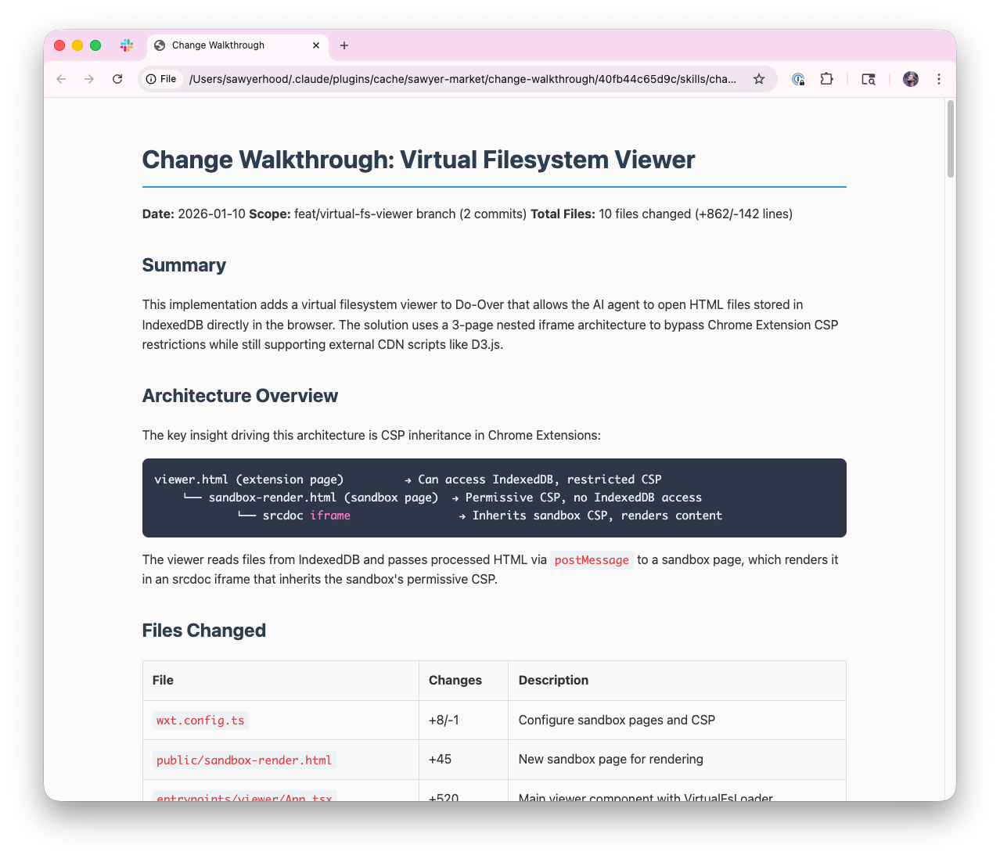

<p align="center">
  
</p>


A Claude Code marketplace of my generally useful skills and plugins.

This includes my skills for:

- Looking up library documentation
- Reviewing ai generated code changes
- Doing git worktree management

## Prerequisites

- [Claude Code](https://docs.anthropic.com/en/docs/claude-code) CLI installed

## Installation

From Claude Code, run:

```
/plugin marketplace add sawyerhood/sawyer-mart
```

Then install any plugin you want:

```
/plugin install <plugin-name>@sawyerhood/sawyer-mart
```

Restart Claude Code after installation.

## Plugins

### library-docs

Look up documentation and source code for libraries and packages. Useful when you need to understand a library's API or encounter unfamiliar library usage.

Similar to [Context7](https://github.com/upstash/context7), but instead of just looking at public docs, it finds the library on GitHub, clones it to a temp directory, and searches the source for answers. This can significantly improve Claude's ability to use up-to-date versions of libraries correctly. 

**Install:**
```
/plugin install library-docs@sawyerhood/sawyer-mart
```

**Usage:**

> "Implement this using ai-sdk v6 and use library-docs to make sure you understand the api."

---

### change-walkthrough

Generate detailed markdown walkthroughs of code changes and opens a readable html version in your browser. It has a focus on walking you through the change showing the highlights of the main code patterns and architectural choices using code snippets. This is perfect the middle ground between pure vibe coding and doing full code review and this lets me ship code quickly while still knowing what is going on and being able to flag issues quickly.



**Install:**
```
/plugin install change-walkthrough@sawyerhood/sawyer-mart
```

**Usage:**

> "Create a walkthrough of the changes I just made"

---

### workflow

Git worktree management commands for task-based development. A lightweight alternative to [Conductor](https://conductor.build) for managing parallel workstreams in your terminal. 

**Install:**
```
/plugin install workflow@sawyerhood/sawyer-mart
```

**Commands:**

| Command | Description |
|---------|-------------|
| `/workflow:workspace <task>` | Create a new git worktree and branch for a task |
| `/workflow:cleanup [branch]` | Merge a worktree branch into main and clean up |

**Usage:**

> `/workflow:workspace add user authentication`

Creates a new worktree at `../repo-add-user-authentication` with a branch named `add-user-authentication` and installs dependencies.

> `/workflow:cleanup`

Merges the current branch into main, removes the worktree, and deletes the branch.

---

## Contributing

See [CONTRIBUTING.md](CONTRIBUTING.md) for guidelines.

## License

MIT

## Author

[Sawyer Hood](https://github.com/sawyerhood)
